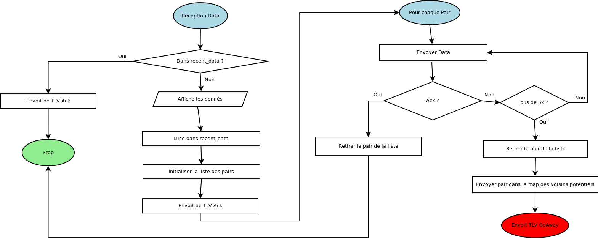

# Usage

- `$ make` génère le fichier executable `client`.
- `$ ./manual` ouvre un nouvel onglet du navigateur par défaut sur la racine de la documentation doxygen.
- `$ doxygen Doxyfile` génère cette même documentation.

La documentation de la map est dans `./doc/map`.

# Contenu des fichiers

## types

`types.h` contient tous les types non standards afin de les centraliser et d'éviter les conflits d'importation.

`types.c` contient tous les générateurs de ces types.

## test

`test.h` et `test.c` sont les fichiers dans lesquels sont écrits les différents tests.

## map

`map.h` et `map.h` sont les fichiers de la hashmap récupérée sur github.com.

## dllist

`dllist.h` et `dllist.c` contienent toutes les fonctions de manipulation de listes doublement chaînées de type `dllist_t`.

## msg

`msg.h` et `msg.c` implémentent toutes les methodes de manipulation et transformations de TLV et messages.

## neighbour

`neighbour.h` et `neighbour.c` implémentent les différentes listes de voisins et leur manipulations.

# Fonctionnement

## Cycle des voisins

## Reception TLV Data

